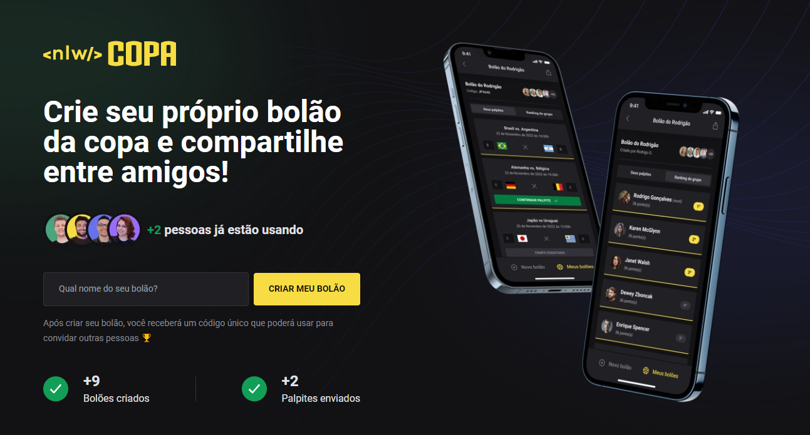

<h1 align="center">
    
</h1>

  

<h2>🏆 Sobre</h2>

Projeto criado durante a Next Level Week Copa, realizado pela Rocketseat. Trata-se de uma aplicação web que permite o usuário criar seu próprio Bolão da Copa do Mundo 2022, onde ele recebe um código após criar, e pode compartilhar esse código para que outras pessoas participem através do aplicativo mobile (Essa aplicação também está aqui no meu repositório, nlw-copa-mobile).

 
<h2>🎯 Objetivo</h2>

Entender na prática as vantagens de se utilizar o NextJS para criar aplicações React. Algumas delas são: renderização da página pelo lado do servidor, garantindo a indexação do site pela Google por exemplo, otimização de imagens, recarregamento automático da página após uma alteração no código, entre outras. Além disso, o projeto serviu como reforço para ver na prática alguns conceitos do React (Estado, Componentes, CSS-in-JS, Hooks, etc.) e estilização utilizando o TailwindCSS.

 
<h2>🛠️ Tecnologias e ferramentas/bibliotecas utilizadas</h2>
<ul>
  <li><a href="https://pt-br.reactjs.org/">ReactJS</a></li>
  <li><a href="https://www.typescriptlang.org/">Typescript</a></li>
  <li><a href="https://tailwindcss.com/">TailwindCSS</a></li>
  <li><a href="https://nextjs.org/">NextJS</a></li>
</ul>
 
<h2>📌 Funcionalidades a serem implementadas</h2>
<ul>
  <li>Aplicar o conceito de Static Site Generator, para reduzir o número de requisições feitas ao back-end para receber os dados do número de bolões, número de palpites e número de usuários, e consequentemente, melhorar a performance da aplicação.</li>
  <li>Criar um componente de Alerta para exibir o código do bolão após ele ser criado. - Ok ✔️</li>
</ul>
 
<h2>🔖 Layout</h2>

Você pode visualizar o layout do projeto através deste link: <a href="https://www.figma.com/file/45PiOwQmjTP7v3m6I1jFFc/Bol%C3%A3o-da-Copa-(Community)?node-id=0%3A1&t=nlajp8XG2BGXZZx7-1">Layout do projeto</a>. É necessário possuir uma conta no <a href="https://figma.com">Figma</a> para acessá-lo.

 
 

Made by Matheus Pazinati 🛸
